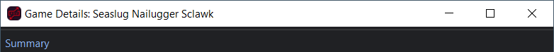

# Important
Plandovania is an unofficial variant of Randovania, and it isn't affiliated or endorsed by Randovania. It contains an experimental branch intended only for use with Plandovania.

### Table of Contents

1. [How to use on Windows](#how-to-use-windows)
2. [About Plandovania](#about-plandovania)
3. [Troubleshooting on Switch - FAQ](#troubleshooting-on-switch-faq)
4. [Running from source - for Developers](#running-from-source-windows)
5. [Readme for Randovania](#randovania)

# How to Use (Windows)

1. Download [Plandovania.7z](https://github.com/realtetrisfreak/plandovania/releases/download/v1.0/plandovania-9.4.0.dev2-windows.7z), extract the zip, and run plandovania.exe.

2. After Plandovania starts, drag-and-drop your `.rdvgame` file into Plandovania or click "Import game file," and follow the on-screen instructions.

3. Export your mod, then load your game on your modded Switch or your emulator. If using an emulator, make sure your mod is "enabled" or "active" for Metroid Dread.

For more information, see [Troubleshooting](#troubleshooting-on-switch-faq) below.

### Prerequisites

Plandovania assumes you have either a modded Switch with Atmosphère, or an emulator setup.

For Plandovania to work, you need an extracted filesystem (romFS) of Metroid Dread. A romFS extraction can be done via an emulator (after you dump your game), command-line tools, or via your modded Switch.

# About Plandovania

## What is this project?

Randovania is a randomizer which works across multiple games. It will read a game's files, and then automatically create a patch to be used with the game. You can randomize the locations of items, or where your game's transports connect to between worlds, for example. This process is handled mostly by the computer.

Plandovania is an unofficial variant of Randovania. It is used for patching Metroid Dread, and it has changes allowing for better manual control over the game. As such, **Plandovania files are incompatible with Randovania**. The reverse is also true, Randovania's files are incompatible with Plandovania.

## Why does this project exist?

Plandovania combines the frontend of Randovania with a modified backend (`open-dread-rando`) to offer more manual control over changing Metroid Dread.

Randovania contains several game patchers inside it, which are responsible for the actual patching of each of the games.

Randovania has a good built-in user-interface for the setting up and exporting of mods and patches. However, `open-dread-rando`, the game patcher for Metroid Dread, didn't have the features I wanted to create custom versions of Metroid Dread. So I combined the two: a custom game patcher for Metroid Dread, and a pleasant user-experience with Randovania.

## Overview of major changes

#### Plandovania

- Information about the mod will be displayed in the export window: Name, Author, Difficulty, and Description.
- Slightly-streamlined import and export process

#### Metroid Dread

- Removes a load-in sequence which would load every unvisited area when traveling to Itorash for the first time, causing excessive load times, each area's music to play and spoil itself, and the game to crash if Dairon hadn't yet been visited.
- Removes "split beam" weapons from the game, a custom change which affected how Samus's beam weapons would work, different from the vanilla experience. "Split beams" would cause Samus to be unable to fire her weapon after receiving a beam weapon upgrade from EMMI, which would fix itself after a reload to checkpoint, but would add unecessary loading times, disrupting the game's flow; in some cases, the beam would change to some other beam when firing it (no more "thin beam" while you have the Wide Beam), causing other disruption; and fan-modded pickups wouldn't properly grant or remove beam weapons on pickup, limiting the kinds of upgrade pathways.
- Resets Dairon's EMMI to no longer roam the area before you get there. I would like there to be a toggle for this, but the vanilla cutscene and activation trigger have been restored. This offers a little more creative freedom in how EMMI is approached in Dairon than before.
- Restores the "Credits" option to the main menu for completed game save files, and removes item locations from being shown in the game's credits. Prior to this change, you could select a completed game save for a different playthrough, and spoil the item locations for the current one (because you only can have one mod active at a time). Now, the game's credits are preserved on the main menu, and can be seen from any completed game save without fear of spoiling the items if you don't want to see them.

---

# Troubleshooting on Switch (FAQ)

### I'm using Atmosphère. Where do I put my game files?

Randovania offers an option to automatically place your files onto your Switch SD card after you insert your SD card into your computer, or via Wi-fi using an FTP connection.

To manually transfer your files, select  "Custom path" on the "Atmosphère (Modded Switch)" option in the Game Patching window in Randovania. When you go to export, two folders will be created: `contents` and `exefs_patches`. Move or copy both folders from your computer to the `atmosphere` folder on your Switch SD card.

Your folder structure on your Switch SD card should look like this afterward:

- `atmosphere\contents`
- `atmosphere\exefs_patches`

### I checked the "Use path compatible for SimpleModManager" checkbox in Randovania, and now I can't find my game in SimpleModManager. Which one is it?

Your game name can be found in the title bar of the Game Details window, after you import an `.rdvgame` file.



In this example, a folder named "Randovania Seaslug Nailugger Sclawk" would be created.

---
# Running from source (Windows)

**NOTE:** This section is mainly for developers who want to convert Windows instructions to run Plandovania from source on Linux or a Mac.

### Overview

1. Clone this git repository
2. Checkout branch `experiment/plandovania-rdv`
3. Modify the `pyproject.toml` file in the root directory. Change `setuptools>=64` to `setuptools==79.0.1` (newer versions break the install).
4. Run `.\tools\prepare_virtual_env.bat --full`
5. To run Plandovania, navigate to `\.venv\Scripts` and run `python -m randovania gui main`

### Prerequisites

1. Install [git](https://git-scm.com/install/windows).
2. Install [python 3.12](https://www.python.org/downloads/release/pymanager-252/) or [here](https://www.python.org/downloads/release/python-31210/) and select the "$PATH" option checkbox in the installer window.

\*This may override existing installs of python and cause errors with your existing python projects. To fix this, run the python installer again (should work).

Randovania will also install the latest version of astral uv, a package manager for python.
but any version published late-2025 early-2026 should work.
If in doubt, try version `0.10.3` or `0.9.17`.

Check uv version by running (in CMD prompt):

`uv -V`  
or  
`uv --version`

Should be at least 0.9.x.

## Step-by-step

After installing [git](https://git-scm.com/install/windows) and [python 3.12](https://www.python.org/downloads/release/pymanager-252/), ~~download and run this .bat file~~ see below, the install script is broken because a dependency updated, causing a breaking change.

Run these commands manually in sequence in a CMD prompt window (inside the folder where you want Plandovania to be installed) (copy and paste each line).

1. `git clone https://github.com/realtetrisfreak/plandovania.git`
2. `cd .\plandovania`
3. `git checkout experiment/plandovania-rdv`
4. Unfortunately, at this point, the `pyproject.toml` is broken. A dependency updated and broke the install script, but also, there are a lot dependencies. So, instead of updating the `pyproject.toml` each time, I decided to write the solution here for future troubleshooting: Open `pyproject.toml` in the root of the `plandovania` folder, and at the top, change the line `"setuptools>=64",` (change the `>=` to `==` and change the version number `64` to `79.0.1`) to read `"setuptools==79.0.1",` and save and close the document. Run this next line inside the command prompt from earlier.
6. `.\tools\prepare_virtual_env.bat --full`
7. At this point, Plandovania should be installed. Keep running the next two lines.
8. `cd .\.venv\Scripts`
9. `python -m randovania gui main`

You can start Plandovania again by starting a CMD prompt inside the `plandovania` folder, and running these two commands.
1. `cd .\.venv\Scripts`
2. `python -m randovania gui main`

Or, create a .bat file outside the folder with the following text, and run it:

```
cd .\plandovania\.venv\Scripts
python -m randovania gui main
```

---

The readme for Randovania can be found below.

---

<!-- The Begin and End comments throughout this document are used in order to pull specific sections of the readme into the main GUI window at runtime. -->

# Randovania

Welcome to Randovania, a randomizer platform for a multitude of games.

New here or looking to install? Check [our website](https://randovania.org/). It also contains the list of supported games.

<!-- Begin WELCOME -->

Randovania can randomize many aspects of its supported games, all while still ensuring they're completable
without using any glitches or exploits. Its features include:

* Randomizing what can be found in each item location. Weapons, keys, and more can end up in
  completely new places.

* Use Multiworld sessions to shuffle items between multiple separate games, alone or with friends.
  All Multiworld games are compatible with each other - mix and match as you like!

* Randomize how areas connect to one another, or what resources are required to travel between areas.
  These options are highly customizable, letting you limit or unleash the chaos.

* Randomize your starting equipment and location. Feeling brave? You can even shuffle items
  you normally start with.

Have fun and start randomizing!

<!-- End WELCOME -->

# Installation

In the [releases page](https://github.com/randovania/randovania/releases), we have zip files
with everything ready to use. Just extract and run!

For Linux users, we recommend using our [Flatpak](https://flathub.org/apps/io.github.randovania.Randovania) instead.

<!-- Begin COMMUNITY -->

# Community

Join the Randovania Discord: <https://discord.gg/M23gCxj6fw>

Invite links for specific games' servers can be found in the `#game-communities` channel in our server.

<!-- End COMMUNITY -->

<!-- Begin CREDITS -->

# Credits

GUI and logic written by [Henrique Gemignani](https://github.com/henriquegemignani/), with contributions
by [SpaghettiToastBook](https://www.twitch.tv/spaghettitoastbook), [gollop](https://github.com/gollop) and [many others](https://github.com/randovania/randovania/graphs/contributors).

[BashPrime](https://www.twitch.tv/bashprime), [Pwootage](https://github.com/Pwootage), and [April Wade](https://github.com/aprilwade) made <https://randomizer.metroidprime.run/>, from which the GUI was based.

Website created by [Hugoshido](https://twitch.tv/hugoshido) and [duncathan_salt](https://twitter.com/duncathan_salt). portfolYOU Jekyll theme by Youssef Raafat. Free for personal and commercial use under the [MIT license](https://github.com/YoussefRaafatNasry/portfolYOU/blob/master/LICENSE).

Installer is powered by [Advanced Installer](https://www.advancedinstaller.com/), which has graciously provided us with an open source license.

Linux Flatpak build contributed by [Ethan Lee](https://flibitijibibo.com/).

## Games

### Metroid Prime
* Game patching via [randomprime](https://github.com/randovania/randomprime). Originally authored by [April Wade](https://github.com/aprilwade), it is now maintained and developed by [toasterparty](https://github.com/toasterparty) with contributions from [others](https://github.com/randovania/randomprime/graphs/contributors)
* Room data collected by UltiNaruto, [EthanArmbrust](https://github.com/EthanArmbrust) and [SolventMercury](https://github.com/SolventMercury).
* Converting Metroid Prime 2 models by [Migs](https://www.twitch.tv/migslive).

### Metroid Prime 2: Echoes
* Game patching written by [Claris](https://www.twitch.tv/claris).
* Room data initially collected by Claris, revamped by [Dyceron](https://www.twitch.tv/dyceron).
* [Menu Mod](https://www.dropbox.com/s/yhqqafaxfo3l4vn/Echoes%20Menu.7z) created by Claris. For more information, see the
[Menu Mod README](https://www.dropbox.com/s/yhqqafaxfo3l4vn/Echoes%20Menu.7z?file_subpath=%2FEchoes+Menu%2Freadme.txt).
* Converting Metroid Prime models by [Migs](https://www.twitch.tv/migslive).

### Cave Story
* Patcher and logic written by [duncathan_salt](https://twitter.com/duncathan_salt).
* Based on the [original randomizer](https://shru.itch.io/cave-story-randomizer) by shru.
* Features contributions from [many others](https://github.com/cave-story-randomizer/cave-story-randomizer/graphs/contributors).

### Metroid Dread
* Game Patching by:
  * [Henrique "Darkszero" Gemignani](https://github.com/henriquegemignani/)
  * [duncathan_salt](https://twitter.com/duncathan_salt)
  * [ScorelessPine](https://github.com/ScorelessPine)
  * [Arcanox](https://twitter.com/ArcanoxDragon)
  * [Migs](https://www.twitch.tv/migslive)
  * [hyperbola0](https://github.com/steven11sjf)
  * [Thanatos](https://github.com/ThanatosGit)

* Logic Database by:
  * [KirbymastaH](https://www.twitch.tv/kirbymastah)
  * [Dyceron](https://www.twitch.tv/dyceron)
  * [XenoWars](https://www.twitch.tv/xenowars1)
  * [Mayberry](https://github.com/MayberryZoom)
  * [Hugoshido](https://twitch.tv/hugoshido)
  * [Tyranisaur](https://github.com/Tyranisaur)

* Assets by:
  * Morph Ball and Speed Booster pickup textures created by [BigSharkZ](https://www.youtube.com/BigSharkZ).
  * Spider Magnet pickup texture by duncathan_salt with help from BigSharkZ.
  * New map icons by [SkyTheLucario](https://github.com/TheSkyknight100).

### Another Metroid 2 Remake
* Game Patching by:
  * [Miepee](https://github.com/Miepee)
  * [JesRight](https://github.com/Jesright73)

* Logic Database by:
  * [Miepee](https://github.com/Miepee)
  * [DruidVorse](https://www.youtube.com/@DruidVorse)
  * [JeffGainsNGames](https://www.youtube.com/@jeffgainsngames)

* Assets by:
  * Morph Ball, and the Missile Launcher sprites were made by ShirtyScarab554 licensed under [CC BY-SA 4.0](https://creativecommons.org/licenses/by-sa/4.0/).
  * Power Grip and the Shiny Nothing Orb were made by ShirtyScarab554, used under [CC BY-SA 4.0](https://creativecommons.org/licenses/by-sa/4.0/), modified by [AbyssalCreature](https://github.com/AbyssalCreature) and licensed under [CC BY-SA 4.0](https://creativecommons.org/licenses/by-sa/4.0/).
  * New door sprites and other AM2R item sprites were made by [AbyssalCreature](https://github.com/AbyssalCreature) licensed under [CC BY-SA 4.0](https://creativecommons.org/licenses/by-sa/4.0/).

### Metroid: Samus Returns
* Game Patching by:
  * [Dyceron](https://www.twitch.tv/dyceron)
  * [Thanatos](https://github.com/ThanatosGit)
  * [Henrique "Darkszero" Gemignani](https://github.com/henriquegemignani/)
  * [duncathan_salt](https://twitter.com/duncathan_salt)
  * Merikatt
  * [Athebyne](https://github.com/f-raZ0R)

* Logic Database by:
  * [Dyceron](https://www.twitch.tv/dyceron)
  * [Miepee](https://github.com/Miepee)
  * [Haxaplax](https://github.com/haxaplax)

## Auto Tracker

### Primes
* Game theme assets were provided by [MaskedTAS](https://twitter.com/MaskedTAS).
* Pixel theme assets were provided by [Uncle Reggie](https://www.twitch.tv/unclereggie).

### AM2R
* AM2R 1.5.5 item sprites were made by [Eskimode7](https://twitter.com/shmegleskimo) licensed under [CC BY-SA 4.0](https://creativecommons.org/licenses/by-sa/4.0/).
* The AM2R DNA sprite was made by [AbyssalCreature](https://github.com/AbyssalCreature) licensed under [CC BY-SA 4.0](https://creativecommons.org/licenses/by-sa/4.0/).
* The AM2R Morph Ball and Power Grip sprites were made by ShirtyScarab554 licensed under [CC BY-SA 4.0](https://creativecommons.org/licenses/by-sa/4.0/).

### Metroid: Samus Returns

* Game theme assets were provided by [Dyceron](https://www.twitch.tv/dyceron).

## Multiworld
Server and logic written by [Henrique "Darkszero" Gemignani](https://github.com/henriquegemignani/).

### Primes
Dolphin and Nintendont integrations written by [Henrique "Darkszero" Gemignani](https://github.com/henriquegemignani/). These were based on [Dolphin Memory Engine](https://github.com/aldelaro5/Dolphin-memory-engine) and Pwootage's Nintendont fork, respectively. In-game message alert initially written by [encounter](https://github.com/encounter).

### Cave Story
Cave Story Doukutsu and CSE2 Tweaked integations written by [duncathan_salt](https://twitter.com/duncathan_salt), [periwinkle](https://github.com/periwinkle9) and [ikuyo](https://github.com/calvarado194).

### Metroid Dread
Integration written by [Thanatos](https://github.com/ThanatosGit) and [Henrique "Darkszero" Gemignani](https://github.com/henriquegemignani/).
The "unplug" icon is by tezar tantular from [Noun Project](https://thenounproject.com/browse/icons/term/unplug/) (licensed under [CC BY 3.0](https://creativecommons.org/licenses/by/3.0/)).

### Another Metroid 2 Remake
Integration written by [Miepee](https://github.com/Miepee). Offworld sprites are licensed under [CC BY-SA 4.0](https://creativecommons.org/licenses/by-sa/4.0/) and are made by [AbyssalCreature](https://github.com/AbyssalCreature), ShirtyScarab554 and [many others](https://github.com/randovania/YAMS/blob/main/YAMS-LIB/sprites/Attribution.md).

### Metroid: Samus Returns
Integration written by [Thanatos](https://github.com/ThanatosGit).

<!-- End CREDITS -->

# Developer Help

## Dependencies

* [Git](https://git-scm.com/downloads)
* [UV](https://docs.astral.sh/uv/getting-started/installation/)
  * This is installed automatically during step 3 of `Getting started`.

## Setup

Getting started:
   1. Clone this repository. If you want to clone your fork, make sure that during the forking process you **uncheck** the `Copy main branch only` checkbox. Because the git history is needed, downloading the zip is *not* supported and will not work.
   2. Open a terminal in the repository root
   3. Run the following file:
      1. Windows: `tools/prepare_virtual_env.bat --thin`
      2. Linux/macOS: `tools/prepare_virtual_env.sh --thin`
   4. You should see "Setup finished successfully." visible when the command finishes.
   5. For certain use cases, such as exporting games or running tests, replace `--thin` with `--full`.

In order to start Randovania, open:
   1. Windows: `tools/start_client.bat`
   2. Linux/macOS: `tools/start_client.sh`

In order to update your repository:
   1. Update the git repository. (With `git pull` or anything else)
   2. Make sure that Randovania is closed.
   3. Re-run the steps from "Getting Started", starting at step 2.
      1. In case of unexpected errors, delete the `.venv` in the root of the repository and start again.
   4. Open Randovania normally.

In order to be able to export games:
   1. Run the "Getting started" step with `--full` instead of `--thin`.
   2. Start Randovania normally.

In order to run the tests:
   1. Run the "Getting started" step with `--full` instead of `--thin`.
   2. Run `uv run pytest`.

In order to run the server:
   1. Run the "Getting started" step.
   2. Run `uv run tools/prepare_dev_server_config.py` once.
   3. If you wish to use any Discord functionality, you'll need to create an app in Discord
   and fill both ids in `tools/dev-server-configuration.json`.
   4. Run the server and client. You can this on
      1. Windows with `tools/start_dev_server.bat` for the server and `tools/start_debug_client.bat` for the client
      2. Linux/macOS with `tools/start_dev_server.sh` for the server and `tools_start_debug_client.sh` for client

This repository uses [pre-commit](https://pre-commit.com/). The hook is automatically configured with
the `prepare_virtual_env` scripts.

Suggested IDE: [PyCharm Community](https://www.jetbrains.com/pycharm/download/)

## Visual Studio Code

Clone this repository and open the folder in Visual Studio Code. It suggests several useful plugins for developing which you should download and install.

If your Python is setup properly, you can use the `Create venv with all exporters` task by pressing CTRL+SHIFT+P, type in `Task`, select `Tasks: Run task` and then select the task. It will create the venv with all the dependencies installed for you.

Then make sure that the Python extension is installed and select the Python installation from the venv via CTRL+SHIFT+P and `Select Python: Interpreter`.

There is also a task defined to run all tests. To run individual tests you can utilise the `Testing` section of Visual Studio Code. You can simply run or debug a test there.

To start Randovania you can press CTRL+F5. If you only press F5, Randovania will start with a debugger. Be aware that starting with a debugger makes the application much slower.

## UV Commands

Updating a single package:
```
uv lock --upgrade-package my-dependency
```

Installing your patcher as editable:
```
uv pip install -e ..\factorio-randovania-mod\
```

# Documentation

- Unfamiliar with a term? Check the [glossary](docs/Glossary.md).
- Adding a new game? Check the [dedicated guide](docs/New%20Game.md).
- Changing a data format? Check the [migrations documentation](docs/Migrations.md).
- Working with the logic database?
  - [Read how the database is organized](docs/Database%20Format.md).
  - Read the [unfinished script for a video](docs/Database%20Editor.md) on how to use the data editor.
